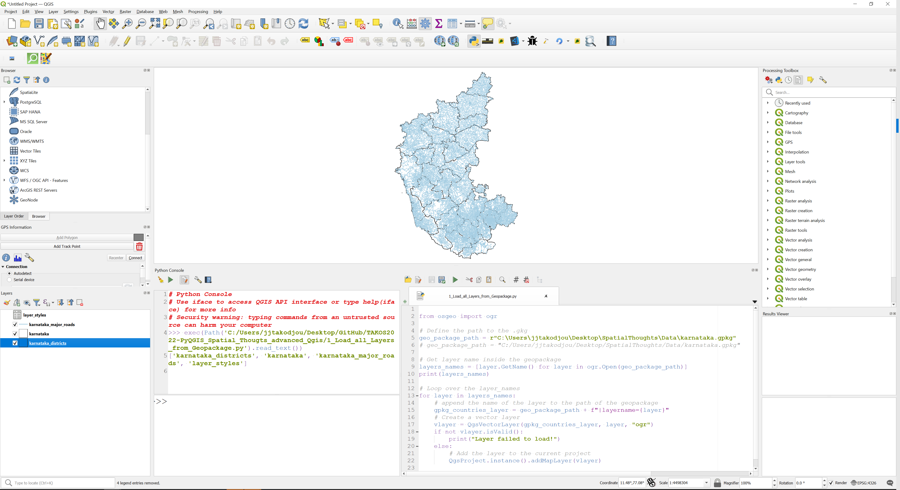

# TAKOS2022-PyQGIS_Spatial_Thougts_advanced_Qgis
I'll do some tasks from the #30DaysOfQGIS using python console in QGIS. I'll share some links for those who want to learn more about the course (Advanced QGIS): 
* [Youtube channel of the course](https://youtu.be/ny-rH9FBpn8?si=ZNHXdO4ID5MWEhRc). 
* [Access the full course material](https://www.youtube.com/redirect?event=video_description&redir_token=QUFFLUhqbUFPa2Q2WmN2bTFGS1c5aUF3cng1OGdDTnFOd3xBQ3Jtc0tsQW53YnZZWks1UVFpMGhpQV8yTWp6Qkc2NmJjT2Y4enJ0ZkNKdU5lQmNoYXNaa2JIckd5LXJYQXgwTUZHYU9Jakl4ZkdQTlZ1cG9zdUxNTzhYMWZvX0l0LVZDZXFjcXRuQlZhdTNCSVpzTU5WTWdHQQ&q=https%3A%2F%2Fcourses.spatialthoughts.com%2Fadvanced-qgis.html&v=ny-rH9FBpn8). 
* [Access the content covered in the video](https://www.youtube.com/redirect?event=video_description&redir_token=QUFFLUhqa2h4SlFwZlA2ZGNkUkE3c0lQRkdKeHVtYm1rZ3xBQ3Jtc0ttRXFCTWhHc05PWjJLb1FiRnc4blhRLXFqMlRXRG9fVlZPSlNYOE5ybEsxLUsySEFGcFpvZWJoNF9lS1FnUFg3UGdoSERNcEQyLVlWTGZrWHBzSEVsS3ZFbTdxRjJEMUxqWlFIbXVmdUVhcmlZS0RaWQ&q=https%3A%2F%2Fcourses.spatialthoughts.com%2Fadvanced-qgis.html%23introduction&v=ny-rH9FBpn8). 
* [Download data](https://drive.google.com/uc?export=download&id=1pAc72QDSZGjZFXGb33N1gxX6is0fKYk4). 
---
# 1-  How to open the Python console inside QGIS and execute the code ? 
You need to first open QGIS after that you can follow one of this method : 
* Press __CRTL+ALT+P__
* Menu __Plugins --> Python Console__
* Directly click on the Python console icon inside the toolbars. 

When the python console is open, you can directly write your command true the command prompt or you can also open the [editor](https://docs.qgis.org/3.4/en/docs/user_manual/plugins/python_console.html#:~:text=The%20QGIS%20Python%20Console%20is,Ctrl%2BAlt%2BP%20) and open the code that i'll share to you every week. Once the code is open, you can press the run command to execute the code. 

---
# 2- Load all layers inside the geopackage.

To import layers inside the geopackages you need to follow this steps : 
* Define the path to the geopackage : 
<pre>
geo_package_path = r"C:\Users\jjtakodjou\Desktop\SpatialThoughts\Data\karnataka.gpkg"</pre>
We can also define the path like this : 
<pre>geo_package_path = "C:/Users/jjtakodjou/Desktop/SpatialThoughts/Data/karnataka.gpkg"</pre>

* Get list of layers in a GeoPackage: 
    *  Import "ogr" module fron "osgeo" package
    <pre>from osgeo import ogr</pre>
    * Get all the layers names inside GeoPackage : 
    <pre>layers_names = [layer.GetName() for layer in ogr.Open(geo_package_path)]</pre>
    * You can print the result to see all the list of layers names
    <pre>print(layers_names)</pre>

* Load all the layers in a GeoPackage and add to the current project : 
<pre># Loop over the layer_names
for layer in layers_names:
    # append the name of the layer to the path of the geopackage 
    gpkg_countries_layer = geo_package_path + f"|layername={layer}"
    # Create a vector layer
    vlayer = QgsVectorLayer(gpkg_countries_layer, layer, "ogr")
    if not vlayer.isValid():
        print("Layer failed to load!")
    else:
        # Add the layer to the current project
        QgsProject.instance().addMapLayer(vlayer)</pre>

You can clone the repository and access the [full code](1_Load_all_Layers_from_Geopackage.py).
Here is the result : 

